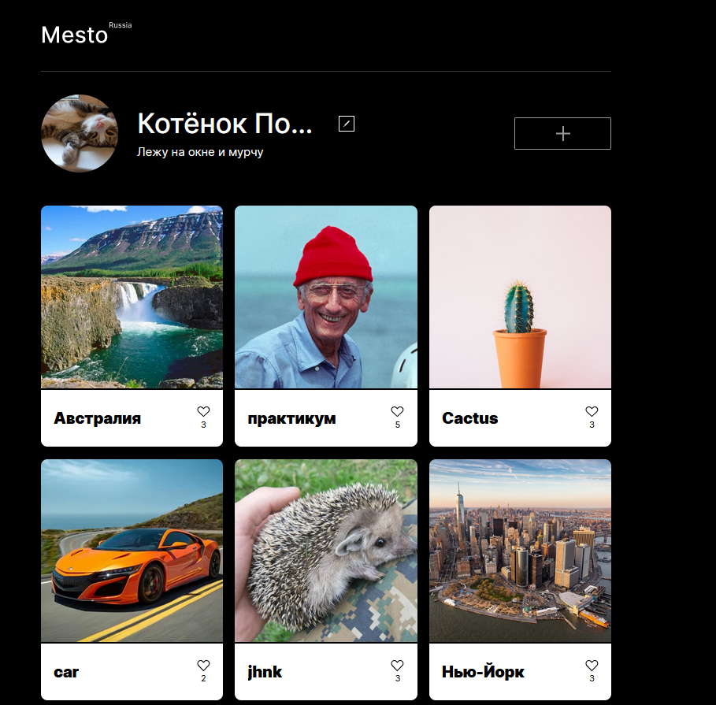
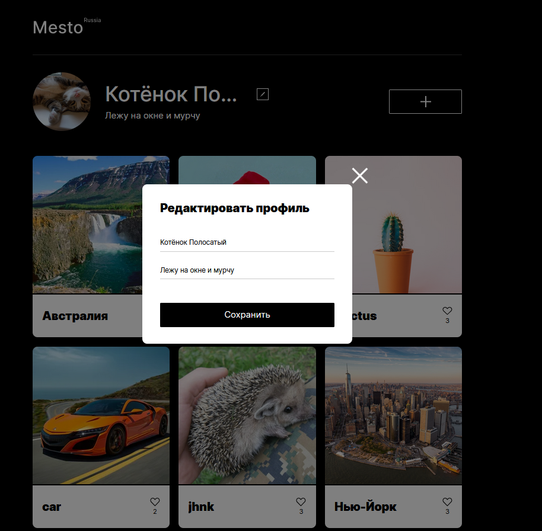
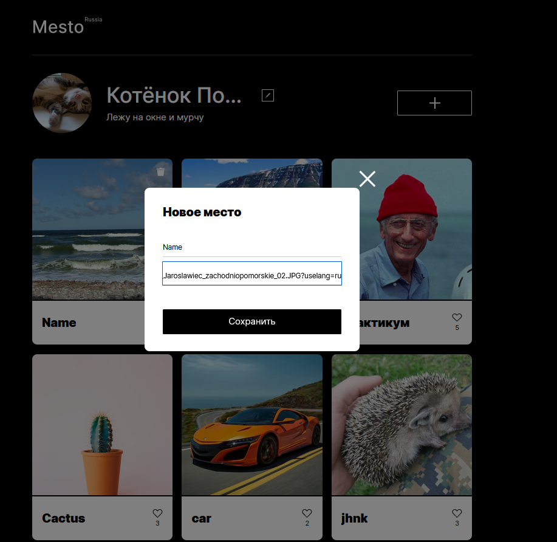
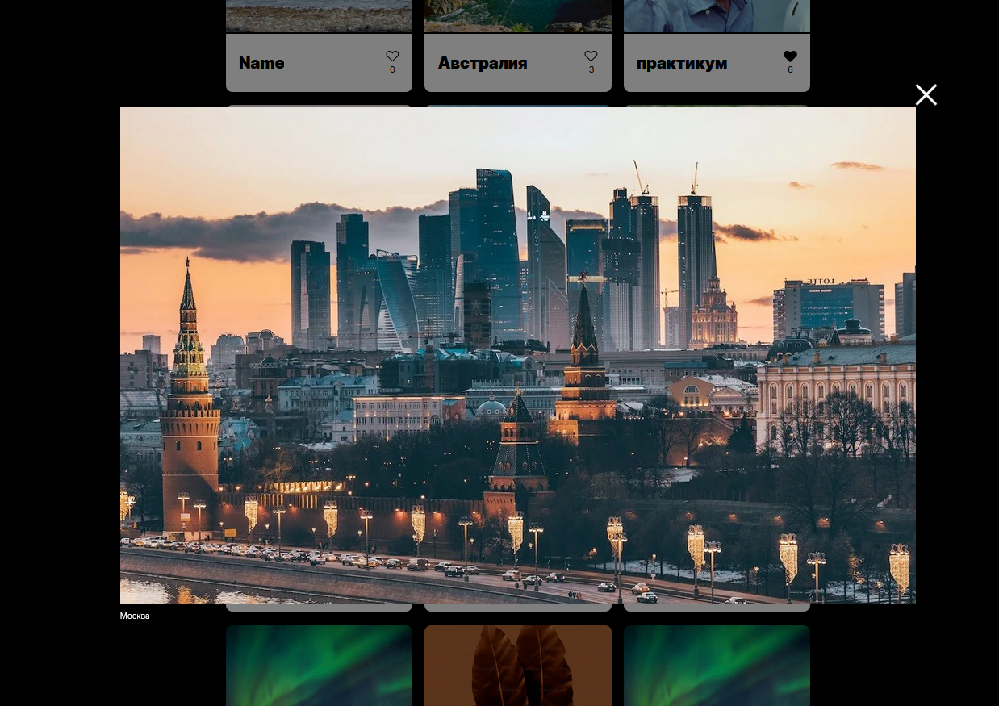

## Mesto - interactive photo gallery app
**Description:** Mesto is an interactive web app for sharing beautiful places (as well as cats and memes).  
Built as a study project during sprints 5–7 of the Frontend Developer course at Yandex.Practicum:
- Sprint 5: "JavaScript basics and DOM manipulation"
- Sprint 6: "Events and forms in JS, modular architecture"
- Sprint 7: "Form validation, API integration, and bundling"    

[Demo availible](https://nanferro.github.io/mesto-project-ff/) in Russian.  

🔧 Stack: HTML5, CSS3, vanilla JavaScript  
🛠️ Tools: Figma, VS Code, Webpack, Git, GitHub, REST API

**Skills:**
- modular JS structure and Webpack bundling
- handling form input and client-side validation
- event-driven UI interactions
- modal logic with JavaScript
- working with a remote REST API (GET/POST/DELETE)
- code separation, reusability, and clean architecture

## Screenshots  
  
  
  
  
